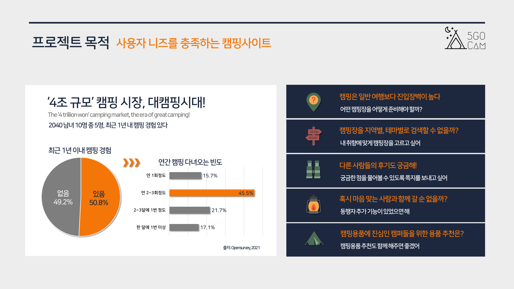

# 캠핑가조

### 문지수 조현영 정소담 임성주

## 주제
캠핑 초보자들을 위한 장소, 일정관리, 캠핑용품 추천서비스

[캠핑가조 웹 페이지](https://campinggajo.r-e.kr/)

## 기술 스택

         

---

## 주요 기능
- 스크롤이 내려가면 검색창과 profile 드롭다운이 존재하는 navbar 나타나 사용자 편의성 개선
- 검색하기 위해 로그인 필요
- main page
  - 전체, 오지/노지, 유료, 클램핑/카라반, 테마검색하여 캠핑장 보기
  - 캠핑용품추천
  - 선호지역 캠핑장 리스트 보기
  - 지역별 리스트 보기
    - 대한민국 지도를 부분별로 클릭하면 지도에 해당 지역 위치 캠핑장 위치 마크 + 리스트
  - 날씨 api 사용 + 비동기 처리하여 지역별 날씨 보기
- accounts
  - 회원가입
    - 선호지역 입력받아 선호지역의 캠핑장들 지도에 마크 + 간단한 detail
    - 주소 입력받아 일정에서 km 거리수
  - 로그인
    - 소셜 로그인
  - 로그아웃
  - 회원 프로필
    - 팔로잉, 팔로워 비동기
    - 방문한 캠핑장, 선호 캠핑장 우선순위, 작성한 리뷰 비동기  + 오픈 캔버스
    - 등록한 일정 세로 carousel
    - 좋아요 한 캠핑장 ↔ 우선순위 드래그앤드랍으로 추가, 삭제
    - 받은, 보낸 쪽지함
  - admin만 post 작성 가능
  - 사장님만 업체 등록 요청 + 업체 수정 요청 가능
- my_messages
  - 쪽지 보내기(user 검색하여 보내기)
  - 답장하기(받는사람을 기존 쪽지 보낸사람으로 고정)
  - 삭제
- posts
  - 캠핑장 정보 작성, 수정, 삭제
    - admin
    - 주소 검색하여 저장 + 지도 띄워 확인
  - 선호지역별 지도와 리스트 보기
  - 카테고리, 자연환경, 편의시설 별 선택하여 필터링한 캠핑장 리스트 보기
  - 전체, 카테고리(오지,노지 / 유료 / 글램핑,카라반)별 최신순, 인기순, 별점순, 댓글순, 방문자순, 지역별 캠핑장 필터링하여 보기
  - 캠핑장명, 주소, 태그 검색
  - 태그 별 캠핑장 보기
  - 좋아요, 방문함 버튼
  - detail page
    - 길찾기, 좋아요, 방문, 인쇄, url 복사 가능
- review
  - 작성, 수정
    - ckeditor 사용
  - 삭제
  - 좋아요, 싫어요
  - 리뷰 개별 detail
- schedules
  - calendar page
    - 일정추가
      - 캠핑장소 검색하여 선택, 동행자 선택, 시작일, 종료일, 메모
    - 추가한 일정은 달력에 표시
    - 달력에 표시된 일정 클릭하면 일정별 detail page 연결
  - detail page
    - d-day , 사는 주소로부터 거리(km)
    - 장소, 지도, 간단한 detail
    - url 복사, 인쇄, 길찾기

---

## 조별 회고

### Keep

- 팀워크
    - 하루하루 분업을 통해 프로젝트 진행
- 기능 우선순위
    - 기능구현의 우선순위를 두고 진행하여 일정 관리 수월

### Problem

- 의사소통
    - 철저한 분업으로 다른 조원의 진행과 코드는 잘 모르는 문제
    - 코드 작성 스타일과 함수 사용에 있어서 모두 달랐기 때문에 의사소통이 자주 필요했지만, 의사소통이 적어 연결 부분에 있어서 지연
- 휴식시간
    - 작업시간과 휴식시간을 적절히 분배하지 못함

### Try

- 의사소통
    - 프로젝트 진행 중 많은 의사소통으로 어떤 기능을 어떻게 구현하고 있는지, 어떻게 진행하고 있는지 서로 계속 대화를 해봐야 할 것 같습니다.
- 코드 작성 스타일
    - 조원들과 코드 작성 스타일을 맞춰 진행해야 할 것 같습니다.
- 휴식시간
    - 작업시간과 휴식시간을 프로젝트 진행 전 적절이 분배하고 공지

---

## 개인별 회고

### 조현영(Backend)

>실력에 자신이 없었는데 좋은 팀원분들 덕분에 많이 배우고 한단계 성장할 수 있었습니다.
프로젝트 중간중간 이슈들이 발생해도 든든한 팀원들이 있다는 사실에 좌절하지 않을 수 있었습니다.
또 생각도 못했던 기능들이나 어렵다고 생각했던 기능들도 구현할 수 있어서 뿌듯했습니다
능력자 팀원들 최고...! 최고입니다 감사합니닿ㅎㅎㅎ

>Keep
초반에 기획을 통해 사용자 위주의 서비스에 대해 생각해볼 수 있었습니다.
또한 기능의 우선순위를 정해놓아서 일정 관리에 수월했습니다.

>Problem
개인적인 실력이 부족함을 느꼈습니다.
새로운 기능을 구현하려고 했을 때 너무 많은 시간을 소모한 것 같아 죄송한 마음이 들었습니다.
다른분들 코드를 다 파악하지 못하여 관련하여 이슈가 발생했을 때 기여를 많이 못한 것이 아쉽습니다.

>Try
개인적으로 공부를 더 열심히해야함을 느꼈습니다.
또한 다음 프로젝트 때는 중간 중간 큰 코드의 흐름들을 파악하고 다른 분들 코드를 공부하며, 모르는 걸 물어보고 싶습니다.
사용자 타게팅과, 요구에 더 집중해서 탄탄한 목적성과 기획성을 지니고 싶습니다.

### 문지수(Backend)

>Keep
이번 프로젝트는 첫 번째 프로젝트보다 완성도 부분에서 조금 더 발전한 것 같습니다. 사용자의 요구와 필수기능을 고려하여 웹페이지를 개발 한 점이 만족스러웠습니다.

>Problem
첫 번째 프로젝트에서 모델 확정이 문제였기 때문에 이번 프로젝트는 모델을 열심히 구상하고 진행했지만, 프로젝트 진행 중 모델수정이 이뤄지면서 계속해서 db를 삭제해야 했던 점이 가장 아쉬웠습니다. 그리고 새로운 기능을 구현하기 위해 계속해서 노력했지만, 시간이 너무 오래 걸렸습니다.  그리고 최선을 다한 점에서는 만족스럽지만 이 때문에 수면시간이 많이 줄어서 건강에 영향을 끼친 점이 가장 아쉽습니다.

>Try
이전의 프로젝트와 이번 프로젝트를 통해서 사용자 요구, 필수기능, 모델확정에 대해 많이 생각해보았기 때문에 마지막 프로젝트에서는 이 부분에 대해 오래 생각하고, 확정을 시킨 후 진행해볼 생각입니다. 그리고 프로젝트로 인해 건강에 영향을 미치지 않도록 적절한 휴식시간과 작업시간을 분배하여 진행할 것입니다.

### 정소담(Fullstack)

>Keep
Github과 Jira를 통해 분업이 잘 되었던 것 같고 실제 현장이 이런 분위기 이지 않을 까 생각이 들었습니다.  분업을 통해 제가 맡은 역할에 몰입하기 좋았습니다. 해결이 안되는 부분은 서로 도울 수 있어 좋았습니다.  제 업무를 하고 오후에 다시 모이면 뚝딱 기능이 만들어져 있었습니다. 사용자 입장에서 생각해서 기능들을 만들어보려고 시도한 점이 만족스럽습니다. 팀원들 멋져요 🥰

>Problem
후 순위 인 것부터 놓지 못해서 시간이 다소 오래 걸렸던 것 같습니다. 때문에 휴식 시간을 제대로 가지지 않아 건강에 영향을 끼친 부분이 아쉬웠습니다.

>Try
당장 해결 하려고 하기 보다는 조금 환기 시켜 줄 수 있는 시간을 가져야 할 것 같습니다. 다른 부분을 먼저 진행하거나 잠깐 쉬어가도 괜찮다는 걸 알게 되었습니다.

### 임성주(Backend)

>Keep
그래도 지난 번 프로젝트보다 약간 더 나아진 부분이 보였습니다. 또한 막연히 두려웠던 부분이 많았는데 좋은 팀원분들 덕분에 그런 부분이 많이 해소가 되었습니다. 그리고 이번에는 백엔드 부분을 맡았는데, 조금은 더 전체적인 것들을 볼 수 있게되었습니다.

>Problem
하지만 여전히 팀원들에게 의존적인 부분이 많았으며, 제가 하는 것도 조금은 벅차서 다른 것들을 돌아보는 시간이 많이 부족했습니다. 또한 코드를 사용함에 있어서도 왜 이 코드를 사용하는지 모르는 부분들도 많았습니다.

>Try
마지막 프로젝트때는 조금 더 능동적인 모습을 보여야 할 것 같습니다. 또한 계속해서 느끼고 있었던 전체적인 진행사항을 보는 능력과 시간을 늘려나가야 할 것 같습니다. 그리고 프로젝트 전 그리고 진행 중에 스스로 공부하는 시간을 가져야 할 것 같습니다.
